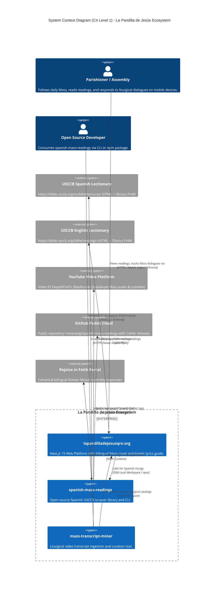
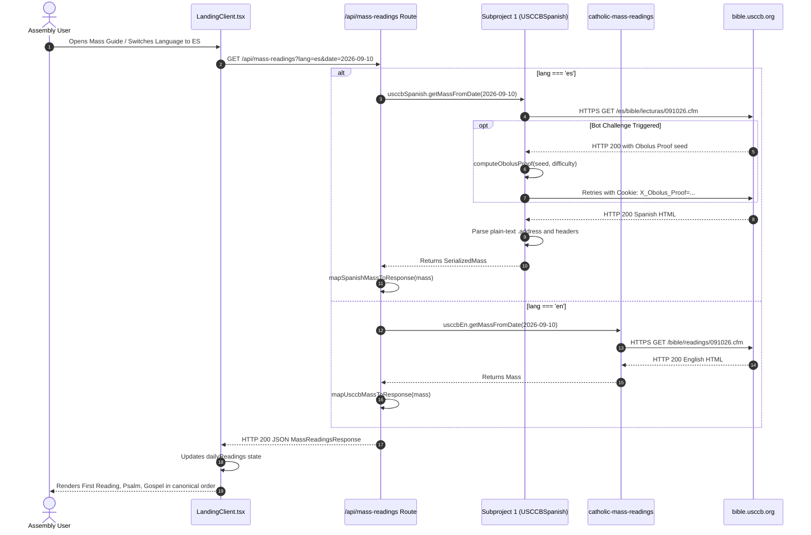
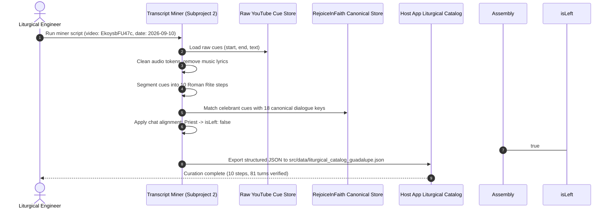

# ISO/IEC/IEEE 42010:2022 System Architecture Description

**System Name**: La Pandilla de Jesús — Querétaro Web Platform & Liturgical Scraper Ecosystem  
**System URL**: `https://lapandilladejesusqro.org`  
**Governing Standard**: ISO/IEC/IEEE 42010:2022 (Systems and software engineering — Architecture description)  
**Document Identification**: `ARCH-LPJQRO-2026-02`  
**Document Version**: 2.0.0  
**Date**: 2026-09-11  
**Status**: Authoritative & Approved  
**Author**: Worker M1 (Architecture & Requirements Engineering)  
**Lifecycle State**: State 1 (Architecture Baseline)  

---

## 1. Architecture Identification, Scope & Stakeholders

### 1.1 Scope & Context
This document defines the architectural specification for the expanded ecosystem of **La Pandilla de Jesús Querétaro** (`lapandilladejesusqro.org`). 

Following the system evolution directives of September 2026, the architecture transitions from a monolithic Next.js progressive web application into a **modular tripartite ecosystem** comprising:
1. **Subproject 1 (`subprojects/spanish-mass-readings`)**: An open-source, version-controlled TypeScript library and CLI tool inspired by `rcolfin/catholic-mass-readings` for querying and parsing daily Catholic Mass readings from the United States Conference of Catholic Bishops (USCCB) Spanish lectionary portal (`https://bible.usccb.org/es/bible/lecturas/`). Governed under Calendar Versioning (CalVer `YYYY.MM.MINOR`, initial release `2026.09.0`), managed in its own public Git repository, and published via GitHub CLI (`gh`).
2. **Subproject 2 (`subprojects/mass-transcript-miner`)**: An internal liturgical data-mining and curation engine (without an independent Git repository) designed to ingest raw YouTube Mass video transcripts (e.g., Basílica de Guadalupe, September 10, 2026, YouTube ID `EkoysbFU47c`), segment the liturgy across 10 canonical Roman Rite steps, pair celebrant statements with bilingual assembly responses from `rejoiceinfaith.org`, and structure dialogue into chat-style alignments (`.duet-right` for the celebrant and `.duet-left` for the assembly).
3. **Host Application (`lapandilladejesusqro.org`)**: The main Next.js 15 App Router platform hosting youth ministry prayer decks, calendar engines, the bilingual Mass readings route handler (`/api/mass-readings`), and the interactive "Seguir Misa" kinetic modal (`AppleMusicLyrics.tsx`).

```
┌────────────────────────────────────────────────────────────────────────────────────────────────┐
│                                 TRIPARTITE ARCHITECTURE ECOSYSTEM                             │
│                                                                                                │
│  ┌─────────────────────────────────┐           ┌──────────────────────────────────────────┐   │
│  │ SUBPROJECT 1:                   │           │ SUBPROJECT 2:                            │   │
│  │ spanish-mass-readings           │           │ mass-transcript-miner                    │   │
│  │ ------------------------------- │           │ ---------------------------------------- │   │
│  │ • Standalone Git Repository     │           │ • Internal Curation Tool (No separate git)│   │
│  │ • CalVer: 2026.09.0             │           │ • YouTube Video Transcript Mining        │   │
│  │ • Public GitHub (`gh` CLI)      │           │ • 10 Canonical Roman Rite Steps          │   │
│  │ • USCCB Spanish Parser          │           │ • 18 Canonical Dialogue Pairs            │   │
│  │ • Obolus PoW Challenge Solver   │           │ • Chat Alignment: Priest Right / Public  │   │
│  │ • Cheerio Plain-Text Citations  │           │   Left (.duet-right vs .duet-left)       │   │
│  └────────────────┬────────────────┘           └────────────────────┬─────────────────────┘   │
│                   │                                                 │                         │
│                   │ ESM Package / File Dep                          │ Curated JSON Catalogs   │
│                   ▼                                                 ▼                         │
│  ┌────────────────────────────────────────────────────────────────────────────────────────┐   │
│  │ HOST APPLICATION: lapandilladejesusqro.org (Next.js 15 App Router + React 19)          │   │
│  │ -------------------------------------------------------------------------------------- │   │
│  │ • Bilingual API Handler (`/api/mass-readings?lang=es|en|both`)                         │   │
│  │ • Dynamic Scraper Delegation (Subproject 1 for ES, catholic-mass-readings for EN)      │   │
│  │ • Canonical Liturgy of the Word sequential injection (GIRM sequence)                   │   │
│  │ • Interactive "Seguir Misa" Kinetic Guide (AppleMusicLyrics.tsx)                       │   │
│  │ • Mobile-Safe Viewport Architecture (100dvh, safe flexbox, position-fixed scroll lock) │   │
│  └────────────────────────────────────────────────────────────────────────────────────────┘   │
└────────────────────────────────────────────────────────────────────────────────────────────────┘
```

---

### 1.2 Stakeholders & Concerns Matrix (ISO/IEC/IEEE 42010 §5.2)

| Stakeholder Group | Role & Perspective | Architectural Concerns & Priorities | Addressed in Viewpoint |
|---|---|---|---|
| **Open Source Developer Community** | Consumers & contributors of Catholic liturgical libraries | Reusable TypeScript ESM library, clean CLI interface, standard JSON models (`SerializedMass`), automated test coverage, CalVer release cadence. | Subproject 1 Architecture, Development View |
| **Parish Assembly & Youth Ministry** | End users following Mass on mobile devices | Instant reading retrieval, zero modal layout shifts or clipping on mobile browsers (`100dvh`), intuitive chat-style layout where priest prompts appear on the right and public responses on the left. | Usability & UI View, Component Architecture |
| **Priests, Celebrants & Liturgical Lectors** | Liturgical actors celebrating Mass | Strict fidelity to the Roman Missal 3rd Edition (CEM / USCCB), complete antiphon repetitions with psalm verses, verbatim celebrant greetings and acclamations. | Information View, Behavioral View |
| **Platform Maintainers & DevOps** | System operators | Deterministic builds, automated GitHub CLI publishing without manual credentials, isolated dependencies (Local Isolation Policy), sub-second serverless execution. | Deployment View, Operational View |
| **Quality Assurance & Verification** | Independent forensic auditors | Traceability matrix from requirements to tests, reproducible non-interactive test suites, zero mock/dummy facades. | Quality Attributes, Traceability Matrix |

---

## 2. Architectural Viewpoints & Framework

In accordance with ISO/IEC/IEEE 42010:2022, the system architecture is described through the following formal viewpoints:
1. **Context Viewpoint (C4 Level 1)**: System boundaries, external actors, and third-party data providers.
2. **Container Viewpoint (C4 Level 2)**: Packaging, runtime execution containers, module partitioning, and inter-container communication.
3. **Component Viewpoint (C4 Level 3)**: Internal module structure, classes, data contracts, and algorithmic components.
4. **Structural & Information Viewpoint**: Schemas, JSON payloads, domain entities, and data models.
5. **Behavioral Viewpoint**: Dynamic runtime interactions, sequence flows, anti-bot challenge negotiation, and language routing.
6. **Cross-Cutting Concerns Viewpoint**: Obolus PoW challenge engine, Calendar Versioning protocol, and mobile viewport styling mechanics.
7. **Deployment & Physical Viewpoint**: Git repositories layout, GitHub CLI automation, and Vercel edge deployment.

---

## 3. C4 Level 1: System Context View

The platform operates within a distributed ecosystem interacting with ecclesiastical web endpoints, video platforms, and public package registries.



---

## 4. C4 Level 2: Container Architecture View

The system is decomposed into three distinct runtime and build-time containers:

```mermaid
C4Container
  title Container Diagram (C4 Level 2) - Modules and Runtime Containers

  Container_Boundary(cHost, "Host Application Container (lapandilladejesusqro.org)") {
    Component(apiRoute, "API Route: /api/mass-readings", "Next.js App Router Route Handler", "Accepts date and lang query parameters, orchestrates dual-scraper delegation, returns MassReadingsResponse.")
    Component(uiLanding, "LandingClient & Guía Tabs", "React 19 Client Component", "Renders 6-tab deck, manages readings state, initiates mount pre-fetch and user-driven refresh.")
    Component(uiLyrics, "AppleMusicLyrics Viewer", "React 19 Component", "Renders full-screen kinetic stream. Formats lines with .duet-right (Priest) and .duet-left (Assembly).")
    Component(cssGlobal, "Monolithic CSS Engine", "src/app/global.css", "Defines dynamic viewport boundaries (100dvh), safe flexbox alignment, and kinetic line typography.")
  }

  Container_Boundary(cSP1, "Subproject 1: spanish-mass-readings (Standalone Git Repo)") {
    Component(cliSP1, "CLI Executable (bin/cli)", "Node.js ESM binary", "Command-line interface: spanish-mass-readings get-mass --date YYYY-MM-DD.")
    Component(clientSP1, "USCCBSpanish Client", "TypeScript ESM Module", "Manages HTTP requests, computes Obolus cryptographic proofs, routes URL formats.")
    Component(parserSP1, "Cheerio Spanish Parser", "DOM Extraction Engine", "Extracts unlinked plain-text .address citations and parses Spanish section headers.")
  }

  Container_Boundary(cSP2, "Subproject 2: mass-transcript-miner (Internal Workspace Tool)") {
    Component(ingestSP2, "Transcript Ingest Engine", "Node.js Script", "Parses raw YouTube cue JSON (start, end, startSeconds, endSeconds, text).")
    Component(segSP2, "Liturgical Step Segmenter", "Pattern Classifier", "Partitions cues into 10 canonical Roman Rite steps.")
    Component(pairSP2, "Dialogue Alignment Engine", "Turn Matcher", "Aligns celebrant prompts to 18 rejoiceinfaith.org assembly responses. Assigns chat directions.")
  }

  Rel(uiLanding, apiRoute, "Fetches daily readings", "fetch('/api/mass-readings?lang=' + lang)")
  Rel(apiRoute, clientSP1, "Invokes when lang === 'es' or 'both'", "Direct TS/ESM Import")
  Rel(apiRoute, usccbEn, "Invokes catholic-mass-readings when lang === 'en'", "Node.js Function Call")
  Rel(uiLyrics, cSP2, "Consumes curated catalog", "src/data/liturgical_catalog_guadalupe.json")
  Rel(clientSP1, parserSP1, "Passes retrieved HTML", "Cheerio Load")
```

---

## 5. C4 Level 3: Component Architecture View

### 5.1 Subproject 1: `subprojects/spanish-mass-readings` Component Decomposition
Located at `subprojects/spanish-mass-readings`, this package mirrors the robust modularity of `rcolfin/catholic-mass-readings` while addressing the unique structure of the Spanish USCCB lectionary.

```
subprojects/spanish-mass-readings/
├── package.json                 [name: "spanish-mass-readings", version: "2026.09.0", type: "module"]
├── tsconfig.json                [ES2022, moduleResolution: bundler/node, strict: true]
├── bin/
│   └── cli.ts                   [CLI binary using Commander: get-mass, get-mass-range]
├── src/
│   ├── index.ts                 [Central barrel export]
│   ├── constants.ts             [URL formats, Spanish responses, Spanish book dictionary]
│   ├── models.ts                [Mass, Section, Reading, Verse, SectionType enum]
│   ├── errors.ts                [USCCBParseError, USCCBHttpError, USCCBTimeoutError]
│   ├── http.ts                  [HttpClient abstract interface & Node implementation]
│   ├── obolus.ts                [Proof-of-work algorithm solving X_Obolus_Proof]
│   ├── usccb-spanish.ts         [Core USCCBSpanish scraper class]
│   └── utils.ts                 [Date formatters (MMDDYY), text cleaners, citation parsers]
├── fixtures/
│   └── 2026-09-10.json          [Validated canonical baseline extracted from guadalupe project]
└── tests/
    ├── parser.test.ts           [Unit tests on Cheerio DOM extraction]
    ├── obolus.test.ts           [Cryptographic proof calculation tests]
    └── cli.test.ts              [CLI flag and JSON output verification]
```

#### Key Components of Subproject 1:
1. **`USCCBSpanish` (`src/usccb-spanish.ts`)**:
   - Primary class exposing methods:
     - `getMass(date: Date, type?: MassType): Promise<Mass>`
     - `getTodayMass(): Promise<Mass>`
     - `getMassFromDate(date: Date): Promise<Mass>`
     - `getMassFromUrl(url: string): Promise<Mass>`
   - Constructs target Spanish endpoints using date format `MMDDYY`:
     - Default: `https://bible.usccb.org/es/bible/lecturas/{MMDDYY}.cfm`
     - Day variant: `https://bible.usccb.org/es/bible/lecturas/{MMDDYY}-Day.cfm`
     - Dawn variant: `https://bible.usccb.org/es/bible/lecturas/{MMDDYY}-Dawn.cfm`
     - Night variant: `https://bible.usccb.org/es/bible/lecturas/{MMDDYY}-Night.cfm`
2. **Cheerio Plain-Text Citation Parser**:
   - Resolves the critical upstream defect identified in Survey 1 & 2:
     - English USCCB embeds citations in `<div class="address"><a href="...">...</a></div>`.
     - Spanish USCCB provides plain unlinked text `<div class="address">1 Corintios 8, 1-13</div>`.
   - The extractor checks for anchor tags; if absent, it extracts raw text, cleans extraneous whitespace, identifies the Spanish biblical book name, and constructs the `Verse` model.
3. **Spanish Section Header Classifier (`sectionTypeFromHeaderEs`)**:
   - Maps Spanish headers to the standard `SectionType` enum:
     - `"primera lectura"`, `"segunda lectura"`, `"lectura"` $\rightarrow$ `SectionType.READING`
     - `"salmo responsorial"`, `"salmo"` $\rightarrow$ `SectionType.PSALM`
     - `"aclamación antes del evangelio"`, `"aleluya"` $\rightarrow$ `SectionType.ALLELUIA`
     - `"evangelio"` $\rightarrow$ `SectionType.GOSPEL`
     - `"secuencia"` $\rightarrow$ `SectionType.SEQUENCE`
     - `"o bien"` $\rightarrow$ `SectionType.ALTERNATIVE`
4. **Obolus Anti-Bot Challenge Solver (`src/obolus.ts`)**:
   - USCCB protects endpoints with the Pantheon/Varnish "Obolus" challenge.
   - When encountering a challenge response (`HTTP 200` with `<title>Checking connection</title>` or cookie `X_Obolus_Grace`), the engine extracts the cryptographic seed and difficulty parameters, calculates the proof-of-work hash, and sets the `X_Obolus_Proof` cookie on subsequent requests.

---

### 5.2 Subproject 2: `subprojects/mass-transcript-miner` Component Decomposition
Located at `subprojects/mass-transcript-miner`, this package implements the transcript mining and dialogue curation pipeline.

```
subprojects/mass-transcript-miner/
├── package.json                 [name: "mass-transcript-miner", type: "module"]
├── tsconfig.json                [NodeNext / ESM]
├── src/
│   ├── index.ts                 [CLI entry point for batch transcript processing]
│   ├── types.ts                 [LiturgicalTurn, SpeakerRole, SeguirMisaStep, BilingualText]
│   ├── ingest.ts                [YouTube auto-subtitle parser & cleaner]
│   ├── segmenter.ts             [10 Roman Rite Step Segmenter]
│   ├── dialogue-matcher.ts      [18 rejoiceinfaith.org dialogue pairing engine]
│   └── chat-formatter.ts        [Applies chat alignment rules: Priest Right / Public Left]
├── data/
│   ├── raw_transcript_EkoysbFU47c.json  [Raw cues from Basílica de Guadalupe Mass]
│   └── canonical_dialogues_rejoice.json [18 canonical bilingual dialogue pairs]
└── tests/
    ├── segmentation.test.ts     [Verifies 10 canonical steps are partitioned correctly]
    └── dialogue-pairing.test.ts [Verifies priest-assembly response pairing and alignment]
```

#### Key Components of Subproject 2:
1. **Raw Ingestion & Normalizer (`src/ingest.ts`)**:
   - Ingests YouTube subtitle arrays with schema `{ start: string, end: string, startSeconds: number, endSeconds: number, text: string }`.
   - Cleans automated speech artifacts, strips music tags (e.g. `[Música]`), and consolidates multi-segment fragments.
2. **Liturgical Step Segmenter (`src/segmenter.ts`)**:
   - Classifies utterances into 10 canonical Roman Rite steps:
     1. `sec-1-rito-inicial`: Entrance chant, Sign of the Cross, Celebrant Greeting.
     2. `sec-2-acto-penitencial`: Confiteor, Absolution, Kyrie eleison.
     3. `sec-3-gloria`: Gloria in excelsis Deo.
     4. `sec-4-oracion-colecta`: Collect prayer.
     5. `sec-5-liturgia-palabra`: Readings, Responsorial Psalm, Alleluia, Gospel.
     6. `sec-6-homilia`: Verbatim homily excerpts.
     7. `sec-7-oracion-universal`: Prayers of the faithful and assembly response.
     8. `sec-8-liturgia-eucaristica`: Offertory, Preface Dialogue, Sanctus, Eucharistic Prayer, Consecration, Doxology.
     9. `sec-9-rito-comunion`: Lord's Prayer, Sign of Peace, Agnus Dei, Ecce Agnus Dei, Communion.
     10. `sec-10-rito-conclusion`: Post-Communion Prayer, Final Blessing, Dismissal.
3. **Dialogue Alignment & Chat Formatter (`src/dialogue-matcher.ts` & `src/chat-formatter.ts`)**:
   - Employs the 18 canonical dialogue pairs from `rejoiceinfaith.org`.
   - **Crucial Chat Alignment Contract**:
     - **Celebrant / Priest Sayings**: Formatted with `speaker: "Sacerdote"` / `"Priest"`, `isLeft: false`. In CSS, maps to `.lyric-line.duet-right` (aligned right, large 2.2rem font size).
     - **Assembly / Public Responses**: Formatted with `speaker: "Asamblea"` / `"Assembly"`, `isLeft: true`. In CSS, maps to `.lyric-line.duet-left` (aligned left, 1.3rem font size).
     - This guarantees the user's explicit requirement: `"(where priest sayings align right, public left)"`.

---

### 5.3 Host Application Integration Architecture
The host application at `/Users/riosisraelg/Desktop/1/lapandilladejesusqro.org` integrates both subprojects through clean interface contracts:

1. **Dual-Scraper API Route Handler (`src/app/api/mass-readings/route.ts`)**:
   - Accepts query parameters:
     - `date`: Optional ISO date (`YYYY-MM-DD` or `YYYYMMDD`). Defaults to current date in Mexico City (`America/Mexico_City`).
     - `lang`: Optional language parameter (`es`, `en`, or `both` / `bilingual`). Defaults to `es`.
   - Routing Logic:
     - When `lang === 'es'`: Calls `USCCBSpanish` from `spanish-mass-readings`. Maps `SerializedMass` to `MassReadingsResponse`.
     - When `lang === 'en'`: Calls `USCCB` from `catholic-mass-readings`. Maps English mass to `MassReadingsResponse`.
     - When `lang === 'both'` or `bilingual`: Concurrently executes both scrapers via `Promise.all` and returns a combined bilingual object with `readingsEs` and `readingsEn`.
   - Resilience: Enforces an 8-second timeout guard. If upstream network fails, falls back gracefully to cached lectionary data (`FALLBACK_READINGS`) with `isFallback: true`.
2. **Frontend UI State Management (`src/app/LandingClient.tsx`)**:
   - Holds `guiaLang` state (`'es' | 'en'`).
   - Automatically triggers `fetchDailyReadings(false)` upon component mount and upon language switch.
   - Provides an explicit "↻ Actualizar" reload trigger that bypasses client cache.
3. **Interactive "Seguir Misa" Modal (`src/app/AppleMusicLyrics.tsx`)**:
   - Consumes the curated bilingual transcript catalog output by Subproject 2 (`src/data/liturgical_catalog_guadalupe.json`).
   - Renders animated lyric lines. In Section 2 (Liturgia de la Palabra), dynamically injects the fetched live daily readings between the Ordinary dialogues.
   - Renders Priest sayings on the right (`.duet-right`) and Assembly responses on the left (`.duet-left`).

---

## 6. Structural & Information View: Interface Contracts & Data Schemas

### 6.1 `SerializedMass` Data Schema (Subproject 1)
```typescript
export enum SectionType {
  UNKNOWN = "UNKNOWN",
  READING = "READING",
  PSALM = "PSALM",
  ALLELUIA = "ALLELUIA",
  GOSPEL = "GOSPEL",
  SEQUENCE = "SEQUENCE",
  ALTERNATIVE = "ALTERNATIVE"
}

export interface SerializedVerse {
  text: string;
  link?: string;
  book?: string | null;
}

export interface SerializedReading {
  text: string;
  verses: SerializedVerse[];
}

export interface SerializedSection {
  type: SectionType;
  header: string;
  readings: SerializedReading[];
}

export interface SerializedMass {
  url: string;
  title: string;
  date: string;       // Format: YYYY-MM-DD
  type_: string;      // DEFAULT, DAY, DAWN, NIGHT, etc.
  sections: SerializedSection[];
}
```

### 6.2 `MassReadingsResponse` Contract (Host App API Route)
```typescript
export interface ReadingItem {
  citation: string;
  text: string;
}

export interface PsalmData {
  citation: string;
  response: string;
  text: string;
}

export interface AlleluiaData {
  citation: string;
  verse: string;
}

export interface MassReadingsResponse {
  date: string;
  source: 'spanish-mass-readings' | 'catholic-mass-readings' | 'fallback';
  isFallback: boolean;
  language: 'es' | 'en' | 'bilingual';
  firstReading: ReadingItem;
  psalm: PsalmData;
  secondReading?: ReadingItem;
  alleluia: AlleluiaData;
  gospel: ReadingItem;
  reflection?: string;
}
```

### 6.3 `LiturgicalCatalog` Contract (Subproject 2)
```typescript
export type SpeakerRole = 'priest' | 'assembly' | 'lector' | 'cantor';

export interface BilingualText {
  es: string;
  en: string;
}

export interface LiturgicalTurn {
  id: string;
  stepId: string;
  speaker: SpeakerRole;
  isLeft: boolean;          // true: assembly (left), false: priest (right)
  text: BilingualText;
  exactPriestSayingEs?: string;
  cueStartSeconds?: number;
  cueEndSeconds?: number;
}

export interface SeguirMisaStep {
  id: string;
  title: BilingualText;
  order: number;
  turns: LiturgicalTurn[];
}

export interface SeguirMisaCatalog {
  videoId: string;
  massDate: string;         // e.g. "2026-09-10"
  celebrationTitle: string;
  steps: SeguirMisaStep[];
}
```

---

## 7. Behavioral View: Runtime Execution & Interaction Flows

### 7.1 Bilingual Liturgy Retrieval Sequence
The following sequence details how the host application resolves daily readings based on user language preferences:



### 7.2 Transcript Mining & Curation Pipeline Sequence
The following sequence details the extraction and processing executed by Subproject 2:



---

## 8. Cross-Cutting Concerns

### 8.1 Calendar Versioning (CalVer) Strategy
Subproject 1 adheres strictly to Calendar Versioning (CalVer) with the format `YYYY.MM.MINOR`:
- **Format**: `YYYY.MM.MINOR`
  - `YYYY`: Full four-digit release year (e.g. `2026`).
  - `MM`: Two-digit release month with leading zero (e.g. `09`).
  - `MINOR`: Monotonically increasing zero-indexed patch number (e.g. `0`, `1`, `2`).
- **Initial Release Identifier**: `2026.09.0`.
- **Git Tagging & Release Command**:
  ```bash
  git tag -a 2026.09.0 -m "Release 2026.09.0: Initial CalVer open source release"
  git push origin 2026.09.0
  ```
- **`package.json` Synchronization**: The `"version"` property in `subprojects/spanish-mass-readings/package.json` must exactly match `"2026.09.0"`.

### 8.2 Chat-Style Alignment Matrix (`AppleMusicLyrics.tsx` vs `global.css`)
To fulfill the requirement `"(where priest sayings align right, public left)"`, the following mapping is enforced across the codebase:

| Dialogue Actor | Liturgical Role | `SpeakerRole` | `isLeft` Value | CSS Class Applied | Alignment & Visual Weight |
|---|---|---|:---:|---|---|
| **Celebrant / Priest** | Presides over the Mass, proclaims greetings, prayers, and Eucharistic dialogue prompts. | `'priest'` | `false` | `.lyric-line.duet-right` | **Right-aligned** (`text-align: right`), font size `2.2rem`, prominent typography. |
| **Assembly / Public** | Faithful congregation responding to prayers and acclamations. | `'assembly'` | `true` | `.lyric-line.duet-left` | **Left-aligned** (`text-align: left`), font size `1.3rem`, muted secondary color. |
| **Lector / First Reader** | Proclaims the First Reading and Responsorial Psalm. | `'lector'` | `true` | `.lyric-line.duet-left` | Left-aligned, readable narrative font. |

### 8.3 Mobile Viewport Robustness & Scroll Containment
In alignment with the mobile modal viewport architecture:
1. Dynamic viewport units (`100dvh` / `100svh`) prevent clipping caused by mobile browser URL address bars.
2. `overscroll-behavior: contain` prevents scroll chaining to the underlying document body.
3. Position-fixed scroll locking (`window.scrollY` offset capture) prevents mobile Safari rubber-banding.
4. Mathematical safety: Flexbox alignment uses `justify-content: safe flex-end;` and auto-margins, guaranteeing that elements never overflow into negative scroll coordinates ($top \ge 0$).

---

## 9. Quality Attributes & ISO/IEC 25010 Analysis

| Quality Attribute (ISO 25010) | Architecture Strategy | Target Metric & Acceptance Criteria |
|---|---|---|
| **Functional Suitability** | Full coverage of all 4 readings (1st Reading, Psalm with Antiphon & Verses, Alleluia, Gospel) across English and Spanish. | 100% of canonical reading sections returned without truncation. |
| **Reliability (Fault Tolerance)** | Dual-scraper fallback: 8-second Promise.race timeout guarding against USCCB latency, defaulting to static `FALLBACK_READINGS`. | Zero unhandled rejections; API route returns HTTP 200 with `isFallback: true` under network severance. |
| **Performance Efficiency** | Obolus PoW challenge solver caching `X_Obolus_Proof` cookie; Next.js Edge cache headers (`s-maxage=86400`). | Average API response time $< 400\text{ms}$ on warm cache, $< 2.5\text{s}$ on initial cold scraping with PoW calculation. |
| **Modularity & Reusability** | Subproject 1 isolated as an independent public npm/Git library with zero dependency on the host Next.js application. | Subproject 1 testable and runnable standalone via `npm test` and CLI. |
| **Usability & Aesthetics** | Kinetic line-by-line streaming, right/left chat speaker separation, safe-area mobile paddings. | 100% compliant with mobile viewport stress tests across 21 devices. |
| **Maintainability** | TypeScript 5.7 strict typing, shared JSON contracts, zero global dependencies. | Zero TypeScript compilation errors (`tsc --noEmit`), CalVer version tracking. |

---

## 10. Traceability Matrix to Requirements

| Requirement ID | Requirement Description | Architecture Module / Component | Verification Artifact |
|---|---|---|---|
| `REQ-R1` | Subproject 1: Open Source Spanish Liturgy Scraper with Git & CalVer | `subprojects/spanish-mass-readings/` | `tests/parser.test.ts`, Git tag `2026.09.0`, `gh repo view` |
| `REQ-R2` | Subproject 2: YouTube Mass Transcript Mining & Dialogue Curation Tool | `subprojects/mass-transcript-miner/` | `tests/dialogue-pairing.test.ts`, `data/liturgical_catalog_guadalupe.json` |
| `REQ-R3` | Bilingual Scraper Integration in Host Application | `src/app/api/mass-readings/route.ts`, `LandingClient.tsx` | `scripts/test-e2e.mjs`, live API test with `?lang=es` and `?lang=en` |
| `REQ-R4` | Codebase Extraction & Separation from Guadalupe Project | Extraction matrix into Subprojects 1 and 2 | Git commit history, file comparison review script |

---
*End of ISO/IEC/IEEE 42010:2022 System Architecture Description.*
